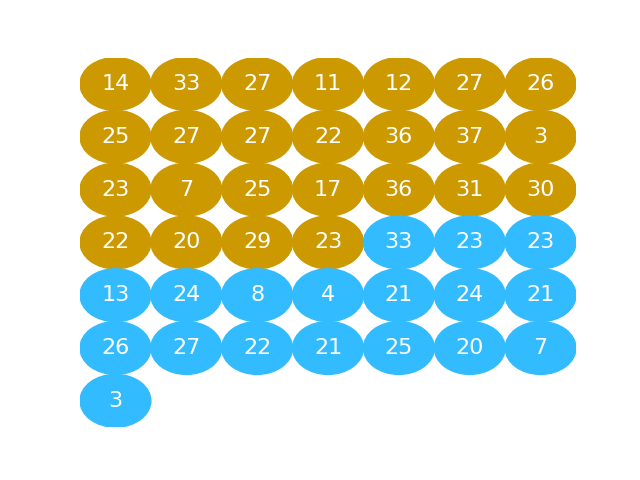
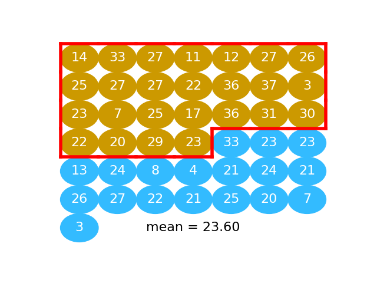
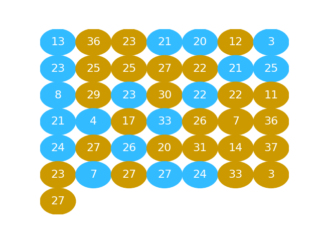
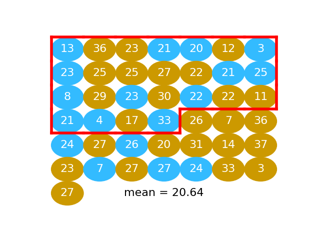
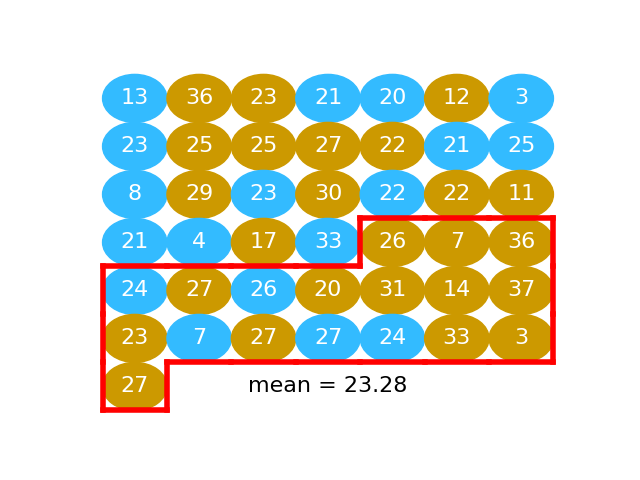
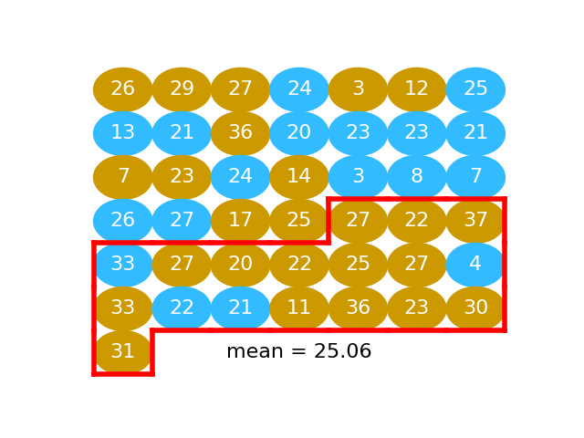

---
jupyter:
  jupytext:
    notebook_metadata_filter: all,-language_info
    split_at_heading: true
    text_representation:
      extension: .Rmd
      format_name: rmarkdown
      format_version: '1.2'
      jupytext_version: 1.14.1
  kernelspec:
    display_name: Python 3 (ipykernel)
    language: python
    name: python3
  orphan: true
---

# Back to permutation

This page goes back to permutation, now you know about [permuting labels](../fishers_tea.Rmd)
and [GroupBy](../useful-pandas/groupby.Rmd).

It gives another way of doing the permutation, that you have already seen, as
consolidation for the ideas of:

* Permutation.
* Permuting labels.
* GroupBy.

## Do mosquitoes like beer?

We have already seen this dataset in [the idea of
permutation](permutation_idea.Rmd).

If you want to run this notebook on your own computer, Download the data from
{download}`mosquito_beer.csv <../data/mosquito_beer.csv>`.

As you remember, the data are results from an experiment to test whether
drinking beer makes people more attractive to mosquitoes.

The experimenters got 43 volunteers to sit in a plastic tent. There was a
plastic tube connecting the tent to a closed box of 50 mosquitoes.  When the
subject had been sitting in the tent for long enough to let the from tent flow
down the tube, the experimenters opened the box to let the mosquitoes fly down
the tube.  There was mesh at the tent end of the tube to stop the mosquitoes
reaching the person.   For each trial, the experimenters measured the number of
mosquitoes that left the box and flew into the tube, towards the person in the
tent.  They called this count the "activated" number of mosquitoes, and took
greater counts to mean the mosquitoes were more attracted to the air in the
tent.

Of the 43 subjects, 25 drank beer before they sat in the tent, and 18 drank
water.  This page compares the "activated" counts for the 25 subjects who had
drunk beer, compared to the counts for the 18 subjects who had drunk water.

In fact each subject sat in the tent twice, once "before" they had drunk their
allocated drink (beer or water), and once "after" they had drunk their
allocated drink.

Here we only look at the "after" counts.

See [this
page](https://github.com/matthew-brett/datasets/tree/master/mosquito_beer) for
more details on the dataset, and [the data license page](../data/LICENSE).

First our usual preamble:

```{python}
# Import Numpy library, rename as "np"
import numpy as np
# Make random number generator.
rng = np.random.default_rng()
# Import Pandas library, rename as "pd"
import pandas as pd
# Safe setting for Pandas.
pd.set_option('mode.copy_on_write', True)

# Set up plotting
import matplotlib.pyplot as plt
plt.style.use('fivethirtyeight')
```

Read in the data, select the "after" counts, and the "activated" column.

The "group" column has the allocated drink: "beer" or "water".

```{python}
mosquitoes = pd.read_csv('mosquito_beer.csv')
after_activated = mosquitoes.loc[mosquitoes['test'] == 'after',
                                 ['group', 'activated']]
after_activated
```

Get the means per group.

```{python}
means = after_activated.groupby('group')['activated'].mean()
means
```

Get the observed statistic of interest — the difference between the means:

```{python}
observed_stat = means.loc['beer'] - means.loc['water']
observed_stat
```

Now we rethink how we would simulate the null-world, where the association
between the "group" and the "activated" values is random.

Here is a DataFrame we can use, for which we have randomly shuffled the "group"
labels.

```{python}
observed_activated = after_activated['activated']
fake_df = after_activated.copy()
fake_df['activated'] = rng.permutation(observed_activated)
fake_df
```

```{python}
# One trial
fake_df['activated'] = rng.permutation(observed_activated)
fake_means = fake_df.groupby('group')['activated'].mean()
fake_stat = fake_means['beer'] - fake_means['water']
fake_stat
```

```{python}
n_iters = 10000
fake_stats = np.zeros(n_iters)
for i in np.arange(n_iters):
    fake_df['activated'] = rng.permutation(observed_activated)
    fake_means = fake_df.groupby('group')['activated'].mean()
    fake_stats[i] = fake_means['beer'] - fake_means['water']
fake_stats[:10]
```

```{python}
plt.hist(fake_stats, bins=50);
plt.plot(observed_stat, 10, 'ro')
plt.title("Sampling distribution of mean difference")
```

```{python}
p = np.count_nonzero(fake_stats >= observed_stat) / n_iters
p
```

Get the "activated" number for the 18 subjects in the "water" group:

```{python}
# Same for the water group.
waters = afters[afters['group'] == 'water']
water_activated = np.array(waters['activated'])
water_activated
```

Number of subjects in the "water" condition:

```{python}
n_water = len(water_activated)
n_water
```

## The permutation way


* Calculate difference in means
* Pool
* Repeat many times:
    * Shuffle (permute)
    * Split
    * Recalculate difference in means
    * Store


The next graphic shows the activated values as a series of gold and blue
balls.  The activated numbers for the "beer" group are gold), and the activated
numbers for the "water" group, in blue:



## Calculate difference in means

Here we take the mean of "beer" activated numbers (the numbers in gold):



```{python}
beer_mean = np.mean(beer_activated)
beer_mean
```

Next we take the mean of activation values for the "water" subjects (value in
blue):


```{python}
water_mean = np.mean(water_activated)
water_mean
```

The difference between the means in our data:

```{python}
observed_difference = beer_mean - water_mean
observed_difference
```

## Pool

We can put the values values for the beer and water conditions into one long
array, 25 + 18 values long.

In order to do this, we use the `np.concatenate` function.  It does what we
want; it takes two arrays and splices them together into one long array.  This
operation is called *concatenation*.

Here is `np.concatenate` in action:

```{python}
first_array = np.array([10, 20, 30])
second_array = np.array([99, 199, 299])
# The two arrays concatenated.
both_together = np.concatenate([first_array, second_array])
both_together
```

We apply `np.concatenate` to *pool* our two groups of numbers into one array.

```{python}
pooled = np.concatenate([beer_activated, water_activated])
pooled
```

## Shuffle

Then we shuffle the pooled values so the beer and water values are completely
mixed.

```{python}
shuffled = rng.permutation(pooled)
shuffled
```

This is the same idea as putting the gold and blue balls into a bucket and shaking them up into a random arrangement.



## Split

We take the first 25 values as our fake beer group.  In fact these 25 values
are a random mixture of the beer and the water values.  This is the same idea as taking 25 balls at random from the jumbled mix of gold and blue balls.

```{python}
# Take the first 25 values
fake_beer = shuffled[:n_beer]
```



We calculate the mean:

```{python}
fake_beer_mean = np.mean(fake_beer)
fake_beer_mean
```

Then we take the remaining 18 values as our fake water group:

```{python}
fake_water = shuffled[n_beer:]
```



We take the mean of these too:

```{python}
fake_water_mean = np.mean(fake_water)
fake_water_mean
```

The difference between these means is our first estimate of how much the mean difference will vary when we take random samples from this pooled population:

```{python}
fake_diff = fake_beer_mean - fake_water_mean
fake_diff
```

## Repeat

We do another shuffle:

```{python}
shuffled = rng.permutation(pooled)
```


We take another fake beer group, and calculate another fake beer mean:

```{python}
fake_beer = shuffled[:n_beer]
np.mean(fake_beer)
```

We take another fake water group, find the mean:



```{python}
fake_water = shuffled[n_beer:]
np.mean(fake_water)
```

Now we have another example difference between these means:

```{python}
np.mean(fake_beer) - np.mean(fake_water)
```

We can keep on repeating this process to get more and more examples of mean
differences:

```{python}
# Shuffle
shuffled = rng.permutation(pooled)
# Split
fake_beer = shuffled[:n_beer]
fake_water = shuffled[n_beer:]
# Recalculate mean difference
fake_diff = np.mean(fake_beer) - np.mean(fake_water)
fake_diff
```

It is not hard to do this as many times as we want, using a `for` loop:

```{python}
fake_differences = np.zeros(10000)
for i in np.arange(10000):
    # Shuffle
    shuffled = rng.permutation(pooled)
    # Split
    fake_beer = shuffled[:n_beer]
    fake_water = shuffled[n_beer:]
    # Recalculate mean difference
    fake_diff = np.mean(fake_beer) - np.mean(fake_water)
    # Store mean difference
    fake_differences[i] = fake_diff
plt.hist(fake_differences);
```

We are interested to know just how unusual it is to get a difference as big as we actually see, in these many samples of differences we expect by chance, from random sampling.

To do this we calculate how many of the fake differences we generated are equal to or greater than the difference we observe:

```{python}
n_ge_actual = np.count_nonzero(fake_differences >= observed_difference)
n_ge_actual
```

That means that the chance of any one difference being greater than the one we observe is:

```{python}
p_ge_actual = n_ge_actual / 10000
p_ge_actual
```

This is also an estimate of the probability we would see a difference as large as the one we observe, if we were taking random samples from a matching population.
